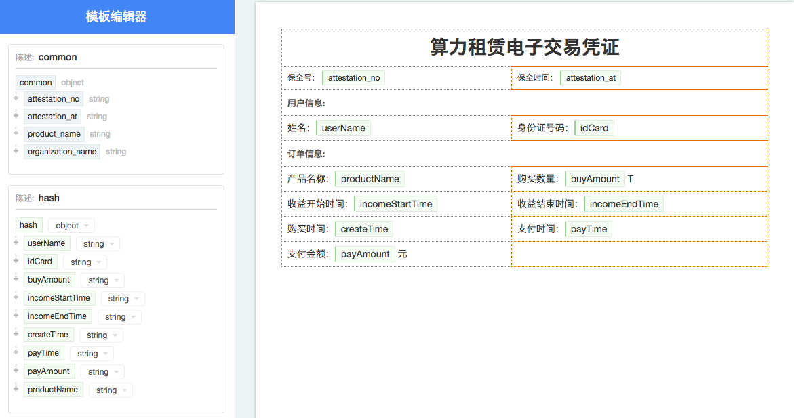

名词介绍
===============

为了更好的使用保全网的API，您首先需要对涉及到的概念有一个基本的了解。

身份标识 - Identity
-------------------

在创建保全时需要提供身份标识。身份标识是保全所有人的身份信息，您可以通过身份标识将保全所有人的身份信息，例如身份证号、电话号码、统一社会信用代码等与该保全关联起来，以便将来用户检索自己拥有的保全数据。一位用户也可以拥有多个身份标识。

Identity代码表:

=====  =============== 
代码    类型  
=====  =============== 
ID     身份证
USCID  统一社会信用代码
=====  =============== 

模板 - Template
---------------

模板是客户在保全网上使用模板编辑器编写的数据结构，模板可以方便客户定义一份有法律效力的电子数据。

陈述 - Factoid
---------------

陈述是保全网接收到的与某个保全关联的数据片段。一个保全可以只包含一个陈述，也可以包含多个陈述。通过API客户可以一次性将一份保全所有相关陈述发送给保全网，也可以通过多次API调用分开发送。

unique_id是保全唯一码，这个唯一码的作用是避免在网络超时或者其它异常的情况下接入方重复上传相同内容的保全数据。如果同样unique_id的保全内容多次上传，保全网只进行1次保全，并返回相同的保全号。

**陈述** 是一个Object对象，包含unique_id,type和data三个字段，例如::

	{
		"unique_id": "9de7be94-a697-4398-945a-678d3f916b9f",
		"type": "hash",
		"data": {
			"userName": "张三",
			"idCard": "42012319800127691X"
		}
	}

陈述的unique_id的作用跟保全的unique_id类似，如果某次保全过程中同样unique_id的陈述内容多次上传到保全网，保全网只处理1次。

type是客户定义的陈述名称，data是陈述的字段值，如下图所示：

模板中包含common和hash两个陈述。common中的attestation_no(保全号)、attestation_at(保全时间)、product_name(产品名称)、organization_name(组织名称)在模板渲染时由保全网提供。hash这个陈述是客户自己定义的，所以需要客户通过API上传。

.. note::
	在添加陈述对象是要保证陈述对象跟编辑模板时的要求一致。以下几种情况会导致保全失败：

	- 上传了模板中没有的陈述对象，比如模板中没有type为product的对象却上传了。
	- 模板中有字段是必要的，但是完成陈述上传时并没有上传该字段，比如user.name需要上传且不能为空，
	  但是没有上传type为user的data或者data中没有name这个字段。
	- 上传的字段的格式不符，比如模板中要求user.money是int型，但是上传的user.money值是"$100"

模板中可能包含多个客户自定义的陈述，比如factoA和factoB，此时客户可以选择分两次上传，第一次上传factoA，并设置completed为false，第二次上传factoB，并设置completed为true。

.. note:: 一旦completed设置为true，则不再接受陈述上传。

假定payload如下所示::

	{
		"unique_id": "acafa00d-5579-4fe5-93c1-de89ec82006e",
		"template_id": "2hSWTZ4oqVEJKAmK2RiyT4",
		"identities": {
			"MO": "15857112383",
			"ID": "42012319800127691X"
		},
		"factoids": [
			{
				"unique_id": "9de7be94-a697-4398-945a-678d3f916b9f",
				"type": "hash",
				"data": {
					"userName": "李三",
					"idCard": "330124199501017791",
					"buyAmount": 0.3,
					"incomeStartTime": "2015-12-02",
					"incomeEndTime": "2016-01-01",
					"createTime": "2015-12-01 14:33:44",
					"payTime": "2015-12-01 14:33:59",
					"payAmount": 600
				}
			}
		]

	}

经过保全后，在保全网上可以通过保全号查看经过渲染后的内容，类似下图所示：

.. image:: images/render_template.png