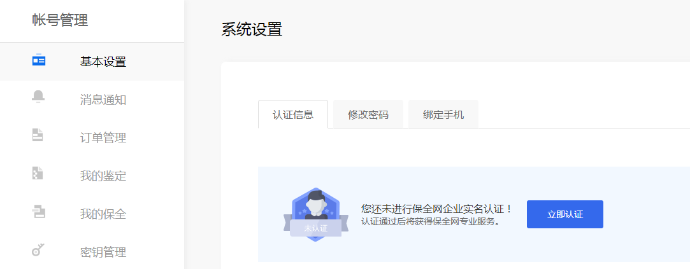
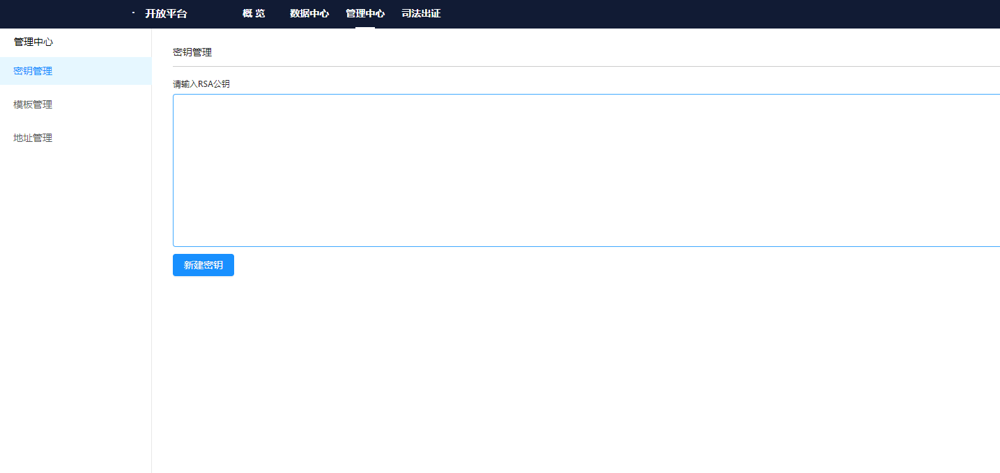
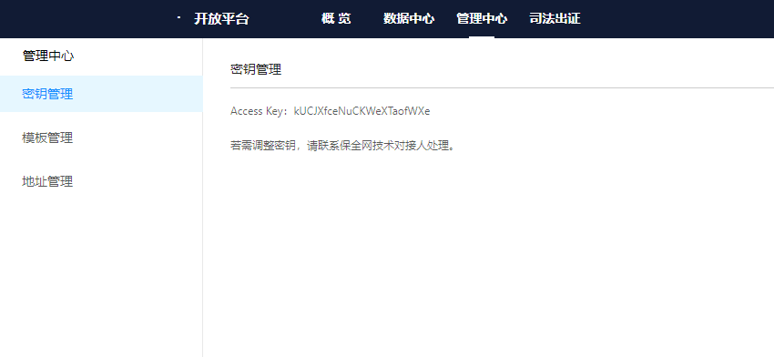

流程
=================

**第一步：注册保全网（www.baoquan.com）企业账号，在账户信息-基本设置中先完成企业实名认证。**

实名完成后请联系客服或者商务申请开通开放平台

**第二步：进入开放平台（api.baoquan.com） 账户信息-密钥管理，新建秘钥。**

**第三步：上传RSA公钥，上传成功后的结果如下：**

可以参考如下shell命令制作自己的证书，openssl版本要求>=1.0.2::

	openssl req -x509 -newkey rsa:1024 -nodes -keyout key.pem -out cert.pem

将cert.pem中的内容粘贴到文本框中。

.. note:: 请保管好自己的私钥，另外强烈推荐在正式环境下使用CA机构签发的证书作为公钥。

假定待签名数据为::

	{
		"request_id": "2XiTgZ2oVrBgGqKQ1ruCKh",
		"access_key": "2y7cg8kmoGDrDBXJLaizoD",
		"tonce": 1464594744,
		"payload": {
			"template_id": "2hSWTZ4oqVEJKAmK2RiyT4",
		}
	}

签名过程用Java代码描述如下::

	// RSA私钥文件路径
	String keyFile = "/path/to/rsa_key.pem";
	
	// 请求数据
	String requestId = "2XiTgZ2oVrBgGqKQ1ruCKh";
	String accessKey = "2y7cg8kmoGDrDBXJLaizoD";
	String tonce = 1464594744;
	String payload = "{\"template_id\": \"2hSWTZ4oqVEJKAmK2RiyT4\"}";

	// API path
	String apiVersion = "v2";
	String apiName = "attestations";
	String path = String.format("/api/%s/%s", apiVersion, apiName);

	// 待签名数据 = 请求方法+API路径+requestId+accessKey+tonce+payload
	String data = "".concat("POST").concat(path).concat(requestId).concat(accessKey).concat(tonce).concat(payload);

	// 构造签名
	PEMReader pemReader = new PEMReader(new InputStreamReader(new FileInputStream(keyFile)));
	PKCS8EncodedKeySpec pkcs8EncodedKeySpec = new PKCS8EncodedKeySpec(pemReader.readPemObject().getContent());
	pemReader.close();
	KeyFactory keyFactory = KeyFactory.getInstance("RSA");
	PrivateKey privateKey = keyFactory.generatePrivate(pkcs8EncodedKeySpec);
	Signature signature = Signature.getInstance("SHA256WithRSA");
	signature.initSign(privateKey);
	signature.update(data.getBytes("UTF-8"));

	// 签名使用Base64编码后得到的值即为请求数据中signature字段的值
	String signatureEncoded = Base64.getEncoder().encodeToString(signature.sign());

.. note:: 签名所用的方法是SHA256WithRSA，签名数据字符串转换成bytes时要用UTF-8编码格式

**第四步：模板配置：**
模板管理页面：
.. image:: images/temlpate1.png
模板详情页面：
.. image:: images/temlpate2.png

根据自己的业务需求配置保全书模板字段 模板与陈述关系详见名词解释

**第四步：开始接口开发：**

